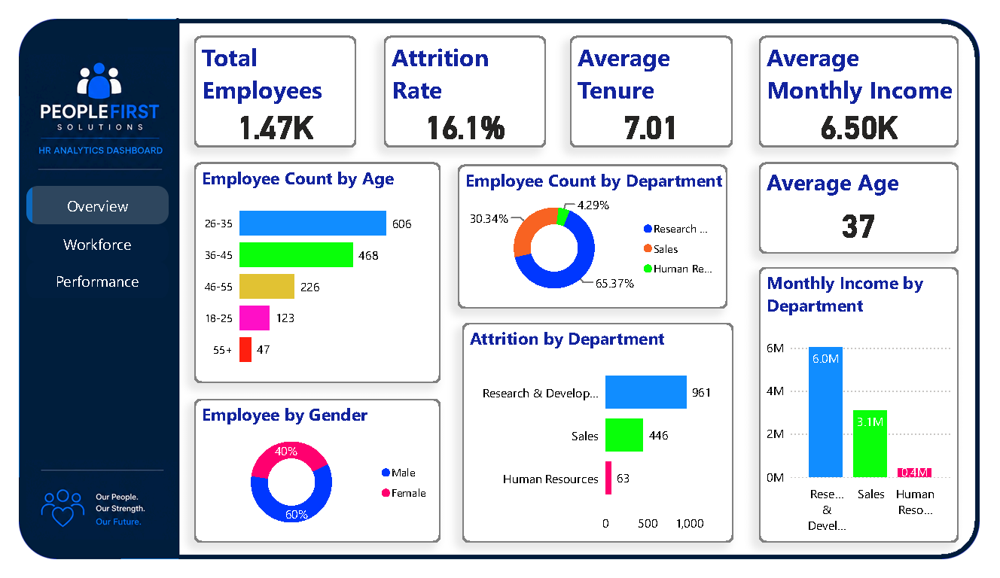
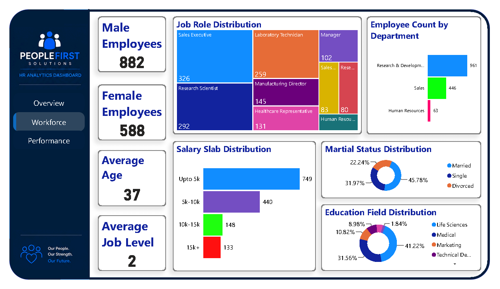
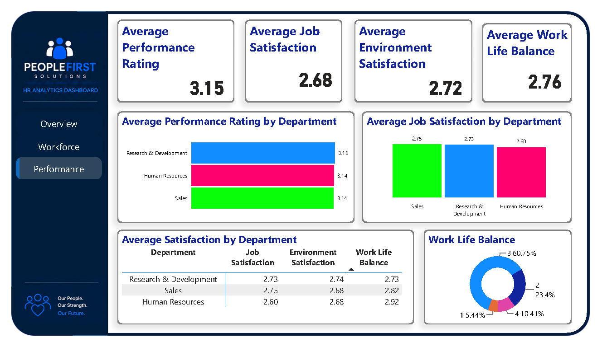

# 📊 HR Analytics Dashboard — Employee Attrition & Workforce Insights


## 📌 Project Overview

This project presents an interactive **Human Resources Analytics Dashboard** developed in Microsoft Power BI to analyze employee demographics, workforce distribution, attrition, compensation, job roles, performance, employee satisfaction, and work-life balance.

The objective was to transform employee-level HR data into an interactive analytical report that allows users to explore workforce composition and identify patterns across departments, age groups, job roles, salary ranges, education fields, and employee experience indicators.

Rather than focusing only on dashboard aesthetics, the project follows a complete analytics workflow:

**Raw HR Data → Data Preparation → Data Modeling → DAX → Visualization → Workforce Insights**

---

## 🎯 Business Problem

Human Resources teams need more than employee counts to understand their workforce.

A useful HR analytics solution should help answer questions such as:

* How large is the current workforce?
* What proportion of employees have left the organization?
* How is the workforce distributed across departments?
* Which age groups represent the largest portion of employees?
* What job roles have the highest employee counts?
* How is compensation distributed across salary slabs?
* How does workforce composition vary by gender?
* What education fields are most common?
* How do job satisfaction, environment satisfaction, and work-life balance vary by department?
* How does performance rating differ across departments?

This dashboard brings these dimensions together into a single interactive Power BI report.

---

# 📊 Dashboard Overview

The report is organized into three main analytical sections:

### 1. Executive Overview

Provides a high-level snapshot of the workforce through key KPIs and demographic/organizational breakdowns.

Key metrics include:

* Total Employees
* Attrition Rate
* Average Monthly Income
* Average Tenure
* Average Age
* Employee distribution by gender
* Employee distribution by age group
* Employee distribution by department
* Attrition by department
* Monthly income by department



### 2. Workforce Analysis

Focuses on the composition and structure of the organization's workforce.

Analysis includes:

* Department distribution
* Education field distribution
* Salary slab distribution
* Job role distribution
* Gender-based employee counts
* Marital status distribution
* Average age
* Average job level



### 3. Performance & Employee Experience

Examines workforce performance and employee experience indicators.

The analysis includes:

* Average performance rating by department
* Average job satisfaction by department
* Average satisfaction across departments
* Job satisfaction
* Environment satisfaction
* Work-life balance
* Overall performance rating
* Overall work-life balance



---

# 🔢 Key Dashboard Metrics

The completed dashboard reports approximately:

| KPI                              |      Value |
| -------------------------------- | ---------: |
| Total Employees                  |      1.47K |
| Attrition Rate                   |      16.1% |
| Average Monthly Income           |      6.50K |
| Average Tenure                   | 7.01 years |
| Average Age                      |         37 |
| Average Job Level                |          2 |
| Average Performance Rating       |       3.15 |
| Average Work-Life Balance        |       2.76 |
| Average Environment Satisfaction |       2.72 |
| Average Job Satisfaction         |       2.68 |

These figures represent the data contained in the completed Power BI report.

---

# 👥 Workforce Composition

The dashboard provides several perspectives for understanding workforce composition.

## Department Distribution

Employees are distributed across:

* Research & Development
* Sales
* Human Resources

The dashboard contains **961 employees in Research & Development, 446 in Sales, and 63 in Human Resources**.

## Age Distribution

Employees are grouped into age categories:

* 18–25
* 26–35
* 36–45
* 46–55
* 55+

The largest displayed age group is **26–35**, with 606 employees.

## Gender Distribution

The dashboard provides a gender breakdown of the workforce, with approximately:

* 60% Male
* 40% Female

## It also reports 882 male employees and 588 female employees.

# 💼 Compensation & Job Structure

The dashboard examines compensation and organizational roles through:

* Salary slab distribution
* Monthly income by department
* Job role distribution
* Job level
* Department-level workforce composition

Salary slabs displayed in the report include:

| Salary Slab | Employees |
| ----------- | --------: |
| Up to 5K    |       749 |
| 5K–10K      |       440 |
| 10K–15K     |       148 |
| 15K+        |       133 |

The report also breaks down employee counts across roles such as Sales Executive, Research Scientist, Laboratory Technician, Manufacturing Director, Healthcare Representative, Manager, and other job roles.

---

# 🎓 Education & Workforce Demographics

The Workforce section provides additional demographic analysis through:

* Education field
* Gender
* Age
* Marital status
* Job level
* Job role
* Department

The education-field distribution includes categories such as Life Sciences, Medical, Marketing, Technical Degree, and other fields.

Marital status is also analyzed across:

* Married
* Single
* Divorced

with the dashboard displaying the corresponding workforce proportions.

---

# 📈 Performance & Employee Experience

The Performance section examines multiple employee-experience indicators together rather than relying on a single satisfaction metric.

## Department-Level Performance

Average performance ratings displayed in the dashboard are:

| Department             | Average Performance Rating |
| ---------------------- | -------------------------: |
| Research & Development |                       3.16 |
| Human Resources        |                       3.14 |
| Sales                  |                       3.14 |

## Department-Level Satisfaction

The dashboard compares:

* Job Satisfaction
* Environment Satisfaction
* Work-Life Balance

across departments.

| Department             | Job Satisfaction | Environment Satisfaction | Work-Life Balance |
| ---------------------- | ---------------: | -----------------------: | ----------------: |
| Research & Development |             2.73 |                     2.74 |              2.73 |
| Sales                  |             2.75 |                     2.68 |              2.82 |
| Human Resources        |             2.60 |                     2.68 |              2.92 |

---

# 🧹 Data Preparation

The project uses employee-level HR data containing demographic, organizational, compensation, satisfaction, performance, and tenure-related attributes.

The dataset schema includes fields such as:

* Employee ID
* Age
* Age Group
* Attrition
* Business Travel
* Department
* Distance From Home
* Education
* Education Field
* Gender
* Job Involvement
* Job Level
* Job Role
* Job Satisfaction
* Marital Status
* Monthly Income
* Salary Slab
* Overtime
* Performance Rating
* Relationship Satisfaction
* Stock Option Level
* Total Working Years
* Training Times Last Year
* Work-Life Balance
* Years at Company
* Years in Current Role
* Years Since Last Promotion
* Years With Current Manager

---

# 🧮 DAX & Analytical Layer

DAX was used to create analytical calculations and KPI values used throughout the dashboard.

The report includes analytical calculations supporting areas such as:

* Employee counts
* Attrition rate
* Average monthly income
* Average age
* Average tenure
* Average job level
* Average performance rating
* Satisfaction metrics
* Department-level analysis
* Workforce distributions

The Power BI report also contains an explicit **Attrition Rate** measure used by the overview dashboard.

Detailed DAX documentation can be found in:

`documentation/dax_measures.md`

---

# 🏗️ Data Model

The Power BI report uses a single primary analytical table:

```text
HR_Analytics
```

The table contains the employee-level records and associated demographic, organizational, compensation, performance, and satisfaction attributes used throughout the report.

Conceptually:

```text
                    HR_Analytics
                         │
        ┌────────────────┼────────────────┐
        │                │                │
   Demographics     Employment       Compensation
        │                │                │
        ├─ Age           ├─ Department    ├─ Monthly Income
        ├─ Gender        ├─ Job Role      ├─ Salary Slab
        ├─ Education     ├─ Job Level     └─ Overtime
        └─ Marital       └─ Tenure
           Status
                         │
                         ▼
                  Employee Experience
                         │
              ┌──────────┼──────────┐
              │          │          │
          Job Sat.   Environment   Work-Life
                       Sat.         Balance
```

This structure keeps the analysis centered on employee-level records and allows the report to slice the workforce across multiple HR dimensions.

---

# 📊 Dashboard Design

The report uses interactive Power BI visualizations including:

* KPI cards
* Bar charts
* Column charts
* Donut/pie-style distribution visuals
* Department comparisons
* Distribution charts
* Matrix/table analysis
* Interactive report navigation

---

# 🛠️ Tools & Technologies

| Technology             | Purpose                                      |
| ---------------------- | -------------------------------------------- |
| **Power BI Desktop**   | Dashboard development and reporting          |
| **Power Query**        | Data preparation and transformation          |
| **DAX**                | Analytical calculations and KPIs             |
| **CSV**                | Source HR dataset                            |
| **Data Modeling**      | Structuring employee-level analytical data   |
| **Data Visualization** | Workforce reporting and insight presentation |

---

# 🔄 End-to-End Workflow

```text
HR Employee Dataset
        │
        ▼
Data Preparation
        │
        ▼
Power BI Data Model
        │
        ▼
DAX Measures & KPIs
        │
        ▼
Interactive Visualizations
        │
        ▼
HR Analytics Dashboard
        │
        ▼
Workforce Insights
```

---

# 📁 Repository Structure

```text
HR-Analytics-PowerBI-Dashboard/
│
├── README.md
│
├── data/
│   └── HR_Analytive.csv
│
├── powerbi/
│   └── HR_Analytics_Dashboard.pbix
│
├── report/
│   └── HR_Analytics_Dashboard.pdf
│
├── screenshots/
│   ├── ececutive_overview.png
│   ├── workforce_analysis.png
│   ├── performance.png
│   └── power_query.png
│
├── documentation/
│   ├── data_preparation.md
│   ├── data_model.md
│   └── dax_measures.md
```

---

# ▶️ How to Use

### 1. Clone the repository

```bash
git clone https://github.com/maw-khan/HR-Analytics-PowerBI-Dashboard.git
```

### 2. Open the Power BI file

Navigate to:

```text
powerbi/HR_Analytics_Dashboard.pbix
```

and open it using **Power BI Desktop**.

### 3. Review the report

Navigate through:

* Overview
* Workforce
* Performance

to explore the interactive analysis.

---

# 💡 Key Analytical Areas

This project demonstrates practical experience across several areas of HR analytics:

### Workforce Analytics

* Workforce size
* Department composition
* Age distribution
* Gender distribution
* Job role distribution

### Attrition Analytics

* Overall attrition rate
* Attrition across departments
* Workforce characteristics associated with the attrition analysis

### Compensation Analytics

* Monthly income
* Salary slab distribution
* Department-level income analysis

### Employee Experience

* Job satisfaction
* Environment satisfaction
* Work-life balance
* Relationship satisfaction

### Performance Analytics

* Performance rating
* Department-level performance comparison
* Job-level workforce analysis

---

# 🎯 Skills Demonstrated

This project demonstrates practical application of:

* Power BI
* Power Query
* DAX
* Data cleaning
* Data transformation
* Data modeling
* KPI development
* Workforce analytics
* HR analytics
* Data visualization
* Dashboard design
* Business-oriented reporting
* Analytical storytelling

---

# 🔐 Data & Privacy

The project uses employee-level HR data containing demographic and employment-related attributes.

The repository is intended for **portfolio and educational purposes**.

---

# 🚀 Project Status

**Completed**

The Power BI dashboard, analytical views, and supporting documentation represent the completed version of the project.

---

# 📌 Project Takeaway

The main objective of this project was to move beyond individual Power BI features and practice an end-to-end analytics workflow.

The project combines:

**Data → Transformation → Modeling → DAX → Visualization → Analysis**

into one HR analytics solution.

It strengthened practical skills in translating employee-level data into structured dashboards that can be explored through multiple business dimensions.

---

## 👤 Author

**Muhammad Ali Waris Khan**

---

## ⭐ If you find this project useful

Feel free to explore the repository, review the dashboard, and connect with me on LinkedIn.

---
